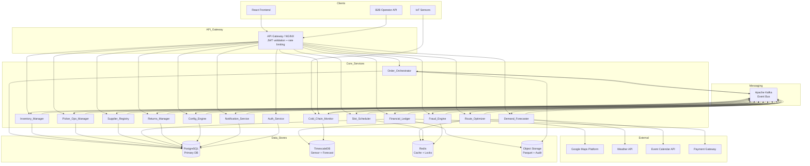
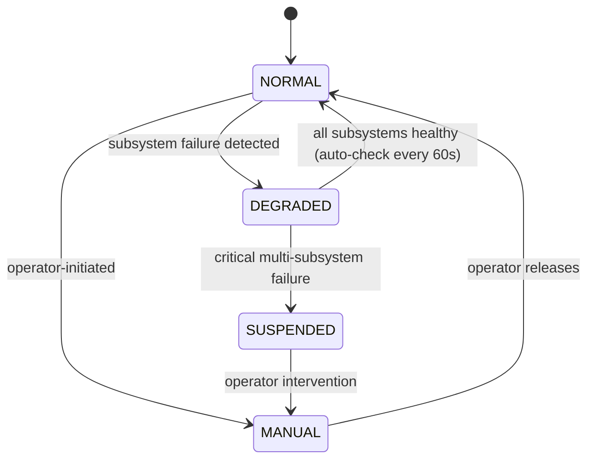
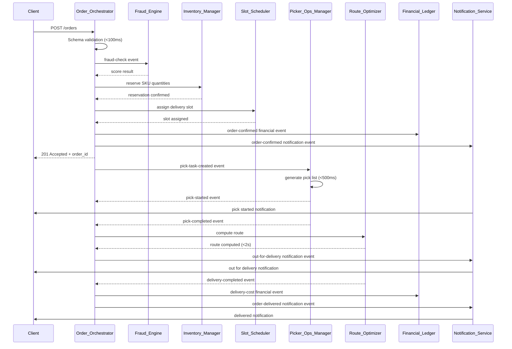
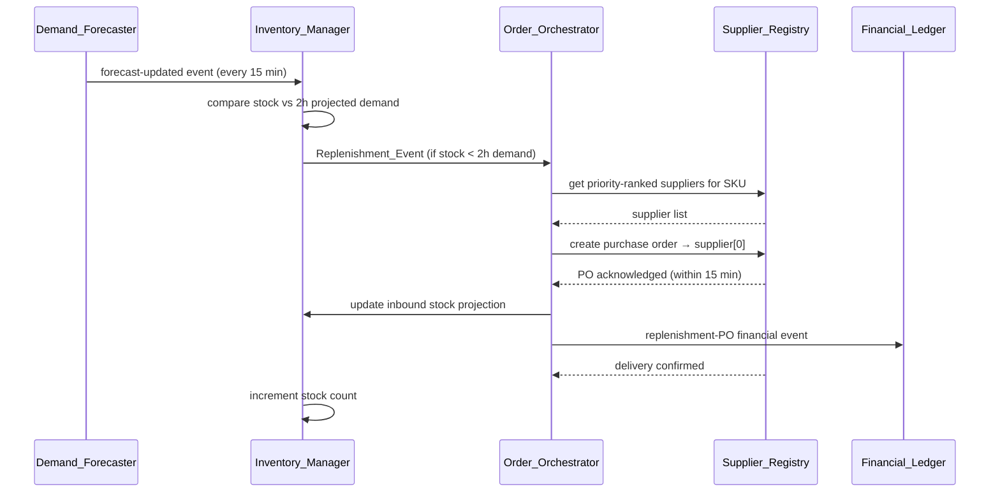
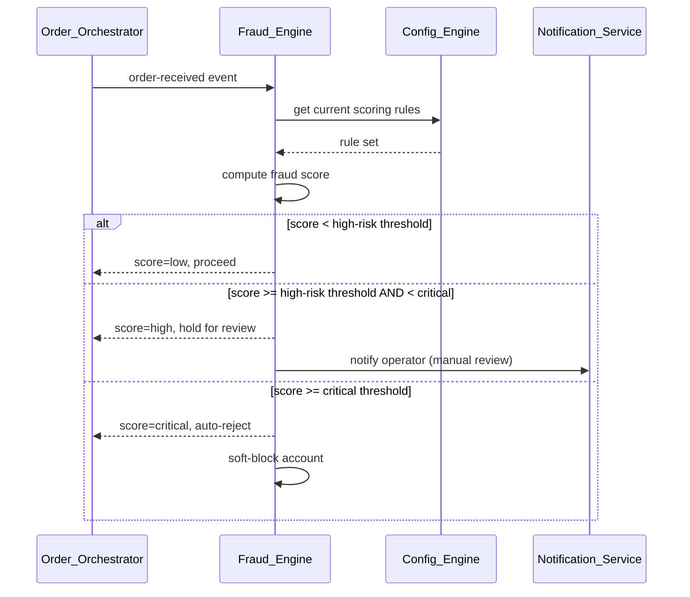
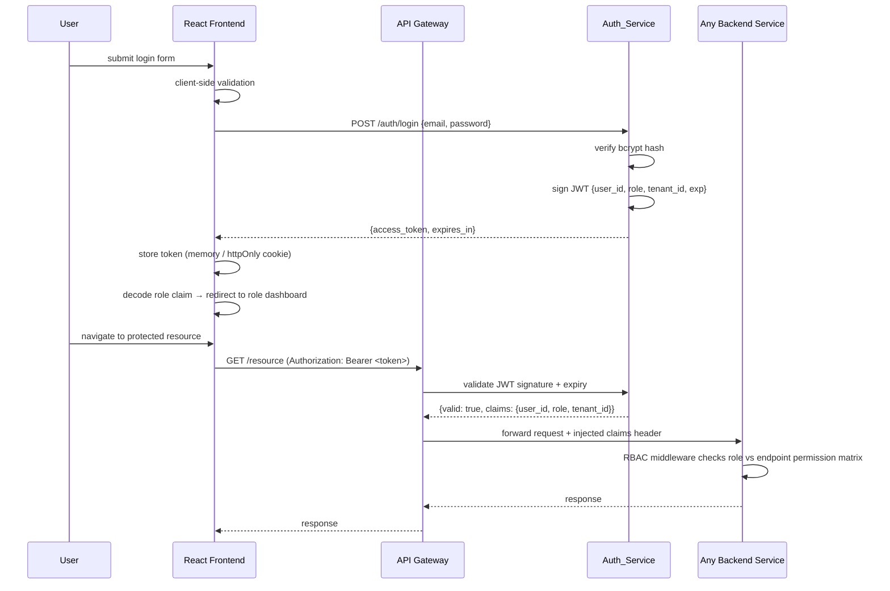

# Design Document: Autonomous Quick-Commerce & Logistics Infrastructure (AQCLI)

## Overview

AQCLI is a multi-tenant, event-driven B2B platform that powers micro-fulfillment centers (dark stores) and sub-15-minute last-mile delivery networks. The system autonomously manages the full order lifecycle — from ingestion and inventory reservation through picking, routing, delivery, and financial settlement — without human intervention in the critical path.

The platform is composed of fourteen named subsystems that communicate primarily through a durable message queue (Apache Kafka). Each subsystem owns its data store and exposes a REST API. A React frontend serves four role-specific dashboards. All API traffic is authenticated via JWT and protected by RBAC middleware implemented in the Auth_Service.

### Technology Stack

| Layer | Choice | Rationale |
|---|---|---|
| Backend services | FastAPI (Python 3.12) | Async-native, excellent for high-throughput event processing; strong ecosystem for ML/forecasting integration |
| Frontend | React 18 + TypeScript | Component model maps cleanly to role-specific dashboards; wide ecosystem |
| Message queue | Apache Kafka | Durable, at-least-once delivery, replay capability, high throughput |
| Primary database | PostgreSQL 16 | ACID transactions for financial ledger and inventory; row-level security for tenant isolation |
| Cache / ephemeral state | Redis 7 | Slot locks, deduplication windows, rate limiting, circuit breaker state |
| Time-series / sensor data | TimescaleDB (PostgreSQL extension) | Cold chain temperature logs, demand forecast series |
| Search / geospatial | PostGIS (PostgreSQL extension) | Dark store proximity, geohash zone aggregation |
| Object storage | S3-compatible (e.g. MinIO) | Parquet export, audit log archival |
| Maps / routing | Google Maps Platform (Routes API, Distance Matrix API, Traffic API) | Real-time travel time, route optimisation |
| Auth tokens | JWT (HS256, configurable to RS256) | Stateless, role-carrying, short-lived |
| Password hashing | bcrypt (cost factor 12) | Industry standard, resistant to brute force |
| Container orchestration | Kubernetes | Horizontal scaling per subsystem, health probes |
| Observability | OpenTelemetry → Prometheus + Grafana | Distributed tracing, metrics, alerting |

## Architecture

### High-Level Component Diagram



### Operational Modes

The system operates in four modes with explicit transitions:



### Order Lifecycle Event Flow



### Replenishment Flow



### Fraud Check Flow



## Components and Interfaces

### Auth_Service

Handles user registration, authentication, JWT issuance, and RBAC middleware. Runs as a standalone FastAPI service; its RBAC middleware is distributed as a shared Python package imported by all other services.

**Key responsibilities:**
- Four role-specific signup endpoints with field validation
- Single login endpoint issuing signed JWTs (HS256, configurable to RS256)
- RBAC middleware: validates JWT, extracts role claim, enforces per-endpoint permission matrix
- Rate limiting on login (10 failed attempts / IP / 15 min → temporary block)
- Audit logging of every login attempt, token issuance, and access violation

**API endpoints:**

| Method | Path | Description |
|---|---|---|
| POST | `/auth/signup/company` | Register Company (Admin) |
| POST | `/auth/signup/delivery-staff` | Register Delivery Department Staff |
| POST | `/auth/signup/courier` | Register Delivery Personnel |
| POST | `/auth/signup/finance-staff` | Register Financial Department Staff |
| POST | `/auth/login` | Unified login → JWT |
| POST | `/auth/forgot-password` | Request password reset token |
| POST | `/auth/reset-password` | Submit new password via reset token |
| GET | `/auth/verify-email` | Verify email via token |

---

### Order_Orchestrator

The central coordinator for the order lifecycle. Receives orders, validates them, routes them to dark stores, monitors SLA compliance, and manages escalations.

**API endpoints:**

| Method | Path | Description |
|---|---|---|
| POST | `/orders` | Ingest new order |
| GET | `/orders/{order_id}` | Get order status |
| PATCH | `/orders/{order_id}/override` | Operator manual override |
| GET | `/orders/{order_id}/audit` | Order audit trail |
| GET | `/orders/active` | List active orders (paginated) |

**Kafka topics produced:** `order.accepted`, `order.routed`, `order.sla-at-risk`, `order.breached`, `order.completed`, `order.cancelled`, `replenishment.requested`

**Kafka topics consumed:** `fraud.result`, `inventory.reserved`, `slot.assigned`, `pick.completed`, `delivery.completed`, `pick.delayed`

---

### Inventory_Manager

Owns the authoritative stock ledger. Processes pick events, replenishment completions, expiry events, and cold chain quarantines.

**API endpoints:**

| Method | Path | Description |
|---|---|---|
| GET | `/inventory/{store_id}/{sku_id}` | Get current stock level |
| POST | `/inventory/reserve` | Reserve SKU quantities for an order |
| POST | `/inventory/release` | Release reservation on cancellation |
| GET | `/inventory/{store_id}/out-of-stock` | List OOS SKUs |
| GET | `/inventory/{store_id}/perishable-waste` | Perishable waste metrics |
| PUT | `/inventory/substitution-map` | Update SKU substitution map |

**Kafka topics produced:** `inventory.reserved`, `inventory.out-of-stock`, `inventory.expiry`, `inventory.cold-chain-quarantine`, `replenishment.event`, `stock.integrity-violation`

**Kafka topics consumed:** `pick.completed`, `replenishment.completed`, `cold-chain.breach`, `forecast.updated`

---

### Demand_Forecaster

Runs scheduled forecast cycles every 15 minutes. Ingests external signals (weather, events, geohash demand density). Produces per-SKU stock recommendations with confidence bounds and Perishable_Confidence_Scores.

**API endpoints:**

| Method | Path | Description |
|---|---|---|
| GET | `/forecast/{store_id}/{sku_id}` | Current forecast + confidence score |
| GET | `/forecast/{store_id}` | All SKU forecasts for a store |
| GET | `/forecast/{store_id}/{sku_id}/signals` | Signal breakdown for operator review |
| GET | `/forecast/underserved-zones` | Geohash zones with capacity gaps |

**Kafka topics produced:** `forecast.updated`, `forecast.recalculation-triggered`, `capacity-gap.detected`

---

### Route_Optimizer

Computes and maintains delivery routes. Integrates with Google Maps Platform. Maintains per-courier performance profiles and congestion indices per zone.

**API endpoints:**

| Method | Path | Description |
|---|---|---|
| POST | `/routes/compute` | Compute route for a batch |
| GET | `/routes/{courier_id}/active` | Get courier's current route |
| GET | `/routes/congestion/{zone_id}` | Current congestion index |
| GET | `/couriers/{courier_id}/performance` | Courier performance profile |

**Kafka topics produced:** `route.computed`, `route.updated`, `congestion.index-updated`, `courier.suspended`

**Kafka topics consumed:** `batch.assigned`, `delivery.undeliverable`, `map.refreshed`

---

### Slot_Scheduler

Manages delivery time-slot capacity. Enforces gig worker time limits and rest periods. Rebalances slots every 60 seconds.

**API endpoints:**

| Method | Path | Description |
|---|---|---|
| POST | `/slots/assign` | Assign slot to an order |
| GET | `/slots/{store_id}/availability` | Available slots |
| GET | `/couriers/{courier_id}/time-ledger` | Operational hours ledger |
| POST | `/slots/{slot_id}/lock` | Lock slot on courier acceptance |

**Kafka topics produced:** `slot.assigned`, `slot.locked`, `courier.suspended`, `courier-pool.expansion-needed`

**Kafka topics consumed:** `order.routed`, `courier.accepted`, `congestion.index-updated`

---

### Picker_Ops_Manager

Generates pick task lists, assigns tasks to pickers, tracks progress, and handles bin discrepancies.

**API endpoints:**

| Method | Path | Description |
|---|---|---|
| GET | `/pick-tasks/{order_id}` | Get pick task list |
| POST | `/pick-tasks/{task_id}/scan` | Submit barcode scan |
| GET | `/pickers/{picker_id}/metrics` | Productivity metrics |
| POST | `/pick-tasks/{task_id}/bin-discrepancy` | Report empty bin |

**Kafka topics produced:** `pick.started`, `pick.completed`, `pick.delayed`, `pick.mismatch`, `bin.discrepancy`

**Kafka topics consumed:** `order.routed`

---

### Supplier_Registry

Maintains supplier profiles, performance scores, and contract terms. Manages probationary periods and suspension logic.

**API endpoints:**

| Method | Path | Description |
|---|---|---|
| GET | `/suppliers` | List suppliers (ranked) |
| GET | `/suppliers/{supplier_id}` | Supplier profile + metrics |
| POST | `/suppliers` | Onboard new supplier |
| PATCH | `/suppliers/{supplier_id}/status` | Update supplier status |
| GET | `/suppliers/{supplier_id}/performance` | Performance metrics |

**Kafka topics produced:** `supplier.demoted`, `supplier.suspended`

**Kafka topics consumed:** `replenishment.po-acknowledged`, `replenishment.completed`, `replenishment.failed`

---

### Financial_Ledger

Immutable double-entry ledger. Records all financial events. Computes Net_Contribution_Margin per order. Produces reconciliation reports.

**API endpoints:**

| Method | Path | Description |
|---|---|---|
| GET | `/ledger/{store_id}/daily` | Daily P&L summary |
| GET | `/ledger/orders/{order_id}` | Per-order financial breakdown |
| GET | `/ledger/{store_id}/unit-economics` | Unit economics view |
| GET | `/ledger/reconciliation` | Daily reconciliation report |
| GET | `/ledger/couriers/{courier_id}/earnings` | Per-courier earnings |

**Kafka topics produced:** `refund.initiated`, `payment-failure.escalated`, `margin-alert.emitted`, `sla-credit.computed`, `below-minimum-earnings.alert`

**Kafka topics consumed:** `order.confirmed`, `order.partial-fulfilled`, `refund.approved`, `inventory.expiry`, `cold-chain.breach`, `replenishment.po-created`, `delivery.completed`

---

### Returns_Manager

Handles post-delivery return requests. Classifies return reasons. Auto-approves eligible refunds.

**API endpoints:**

| Method | Path | Description |
|---|---|---|
| POST | `/returns` | Submit return request |
| GET | `/returns/{return_id}` | Return status |
| GET | `/returns/orders/{order_id}` | Returns for an order |

**Kafka topics produced:** `refund.approved`, `quality-incident.raised`, `return.logged`

**Kafka topics consumed:** `delivery.completed`

---

### Fraud_Engine

Evaluates orders against configurable scoring rules. Manages account-level soft blocks. Consumes rule updates from Config_Engine.

**API endpoints:**

| Method | Path | Description |
|---|---|---|
| POST | `/fraud/evaluate` | Evaluate order (sync, <200ms) |
| POST | `/fraud/feedback` | Operator feedback (confirmed fraud / false positive) |
| GET | `/fraud/rules` | Current active rule set |

**Kafka topics produced:** `fraud.result`, `fraud.rejection`, `account.soft-blocked`

**Kafka topics consumed:** `order.received`, `config.rule-updated`

---

### Cold_Chain_Monitor

Ingests temperature sensor data. Detects breaches. Enforces cold chain compliance before courier assignment.

**API endpoints:**

| Method | Path | Description |
|---|---|---|
| POST | `/cold-chain/readings` | Ingest sensor reading |
| GET | `/cold-chain/{zone_id}/status` | Current zone temperature status |
| GET | `/cold-chain/couriers/{courier_id}/bag-status` | Courier bag sensor status |
| GET | `/cold-chain/logs/{zone_id}` | Temperature log (paginated) |

**Kafka topics produced:** `cold-chain.breach`, `cold-chain.sensor-offline`

---

### Config_Engine

Manages runtime configuration. Propagates changes to all subsystems. Enforces RBAC on writes. Maintains versioned history.

**API endpoints:**

| Method | Path | Description |
|---|---|---|
| GET | `/config/{key}` | Read config value |
| PUT | `/config/{key}` | Write config value (elevated role) |
| GET | `/config/history` | Versioned change history |
| POST | `/config/rollback/{version_id}` | Rollback to previous version |
| GET | `/config/pricing-rules` | Active pricing rules |
| PUT | `/config/pricing-rules` | Publish pricing rule |

**Kafka topics produced:** `config.updated`, `config.pricing-rule-updated`

---

### Notification_Service

Delivers customer and operator notifications. Deduplicates within 5-minute windows. Auto-classifies inbound messages.

**API endpoints:**

| Method | Path | Description |
|---|---|---|
| POST | `/notifications/send` | Send notification (internal) |
| POST | `/notifications/inbound` | Receive inbound customer message |
| GET | `/notifications/templates` | List tenant templates |
| PUT | `/notifications/templates/{template_id}` | Update template |

**Kafka topics produced:** `notification.sent`, `message.resolved`, `message.escalated`

**Kafka topics consumed:** `order.accepted`, `pick.started`, `delivery.out-for-delivery`, `delivery.completed`, `order.sla-at-risk`, `refund.initiated`

## Data Models

### Core Database Schema (PostgreSQL)

#### Auth and User Tables

```sql
-- Central user record
CREATE TABLE users (
    id          UUID PRIMARY KEY DEFAULT gen_random_uuid(),
    name        TEXT NOT NULL,
    email       TEXT UNIQUE NOT NULL,
    password_hash TEXT NOT NULL,          -- bcrypt, cost 12
    role        TEXT NOT NULL CHECK (role IN ('company_admin','delivery_staff','courier','finance_staff')),
    is_active   BOOLEAN NOT NULL DEFAULT FALSE,  -- activated after email verification
    tenant_id   UUID NOT NULL REFERENCES tenants(id),
    created_at  TIMESTAMPTZ NOT NULL DEFAULT now()
);

-- Role-specific profile tables (FK to users)
CREATE TABLE company_profiles (
    user_id         UUID PRIMARY KEY REFERENCES users(id) ON DELETE CASCADE,
    company_name    TEXT NOT NULL,
    company_reg_no  TEXT,
    billing_address TEXT,
    contact_phone   TEXT
);

CREATE TABLE delivery_department_profiles (
    user_id         UUID PRIMARY KEY REFERENCES users(id) ON DELETE CASCADE,
    department_code TEXT,
    store_id        UUID REFERENCES dark_stores(id)
);

CREATE TABLE delivery_man_profiles (
    user_id         UUID PRIMARY KEY REFERENCES users(id) ON DELETE CASCADE,
    vehicle_type    TEXT,
    license_no      TEXT,
    cold_zone_certified BOOLEAN NOT NULL DEFAULT FALSE
);

CREATE TABLE finance_profiles (
    user_id         UUID PRIMARY KEY REFERENCES users(id) ON DELETE CASCADE,
    cost_centre     TEXT,
    approval_limit  NUMERIC(12,2)
);

-- Audit log (append-only, partitioned by month)
CREATE TABLE audit_log (
    id          UUID PRIMARY KEY DEFAULT gen_random_uuid(),
    tenant_id   UUID NOT NULL,
    user_id     UUID,
    event_type  TEXT NOT NULL,
    entity_type TEXT,
    entity_id   UUID,
    payload     JSONB,
    ip_address  INET,
    created_at  TIMESTAMPTZ NOT NULL DEFAULT now()
) PARTITION BY RANGE (created_at);
```

#### Tenant and Dark Store Tables

```sql
CREATE TABLE tenants (
    id              UUID PRIMARY KEY DEFAULT gen_random_uuid(),
    name            TEXT NOT NULL,
    sla_window_sec  INT NOT NULL DEFAULT 900,   -- 15 min default
    surge_threshold NUMERIC(4,2) NOT NULL DEFAULT 1.5,
    dynamic_pricing_enabled BOOLEAN NOT NULL DEFAULT FALSE,
    created_at      TIMESTAMPTZ NOT NULL DEFAULT now()
);

CREATE TABLE dark_stores (
    id              UUID PRIMARY KEY DEFAULT gen_random_uuid(),
    tenant_id       UUID NOT NULL REFERENCES tenants(id),
    name            TEXT NOT NULL,
    geohash6        TEXT NOT NULL,              -- geohash-6 grid cell
    location        GEOGRAPHY(POINT, 4326) NOT NULL,
    status          TEXT NOT NULL DEFAULT 'active' CHECK (status IN ('active','commissioning','suspended')),
    operational_mode TEXT NOT NULL DEFAULT 'NORMAL' CHECK (operational_mode IN ('NORMAL','DEGRADED','MANUAL','SUSPENDED')),
    created_at      TIMESTAMPTZ NOT NULL DEFAULT now()
);
```

#### Order and Inventory Tables

```sql
CREATE TABLE orders (
    id              UUID PRIMARY KEY DEFAULT gen_random_uuid(),
    tenant_id       UUID NOT NULL REFERENCES tenants(id),
    customer_id     UUID NOT NULL,
    store_id        UUID REFERENCES dark_stores(id),
    status          TEXT NOT NULL DEFAULT 'pending',
    sla_deadline    TIMESTAMPTZ NOT NULL,
    fraud_score     NUMERIC(5,2),
    routing_rationale JSONB,
    created_at      TIMESTAMPTZ NOT NULL DEFAULT now(),
    updated_at      TIMESTAMPTZ NOT NULL DEFAULT now()
);

CREATE TABLE order_lines (
    id          UUID PRIMARY KEY DEFAULT gen_random_uuid(),
    order_id    UUID NOT NULL REFERENCES orders(id),
    sku_id      UUID NOT NULL REFERENCES skus(id),
    quantity    INT NOT NULL CHECK (quantity > 0),
    unit_price  NUMERIC(10,2) NOT NULL,
    substitute_sku_id UUID REFERENCES skus(id),
    status      TEXT NOT NULL DEFAULT 'pending'
);

CREATE TABLE skus (
    id                  UUID PRIMARY KEY DEFAULT gen_random_uuid(),
    tenant_id           UUID NOT NULL REFERENCES tenants(id),
    name                TEXT NOT NULL,
    category            TEXT NOT NULL,
    mrp                 NUMERIC(10,2) NOT NULL,
    cogs                NUMERIC(10,2) NOT NULL,
    shelf_life_hours    INT,                    -- NULL = non-perishable
    regulated_flag      TEXT CHECK (regulated_flag IN ('age_restricted','prescription','jurisdiction','none')) DEFAULT 'none',
    temperature_profile TEXT CHECK (temperature_profile IN ('ambient','chilled','frozen')) DEFAULT 'ambient'
);

CREATE TABLE inventory (
    id              UUID PRIMARY KEY DEFAULT gen_random_uuid(),
    store_id        UUID NOT NULL REFERENCES dark_stores(id),
    sku_id          UUID NOT NULL REFERENCES skus(id),
    available_qty   INT NOT NULL DEFAULT 0 CHECK (available_qty >= 0),
    reserved_qty    INT NOT NULL DEFAULT 0 CHECK (reserved_qty >= 0),
    is_out_of_stock BOOLEAN NOT NULL DEFAULT FALSE,
    last_updated    TIMESTAMPTZ NOT NULL DEFAULT now(),
    UNIQUE (store_id, sku_id)
);

CREATE TABLE sku_substitution_map (
    tenant_id       UUID NOT NULL REFERENCES tenants(id),
    original_sku_id UUID NOT NULL REFERENCES skus(id),
    substitute_sku_id UUID NOT NULL REFERENCES skus(id),
    preference_rank INT NOT NULL DEFAULT 1,
    PRIMARY KEY (tenant_id, original_sku_id, substitute_sku_id)
);
```

#### Financial Ledger Tables

```sql
-- Double-entry ledger (immutable)
CREATE TABLE ledger_entries (
    id              UUID PRIMARY KEY DEFAULT gen_random_uuid(),
    tenant_id       UUID NOT NULL REFERENCES tenants(id),
    store_id        UUID REFERENCES dark_stores(id),
    order_id        UUID REFERENCES orders(id),
    entry_type      TEXT NOT NULL,   -- 'debit' | 'credit'
    account         TEXT NOT NULL,   -- 'gmv','cogs','fulfillment','refund','write_off','overhead'
    amount          NUMERIC(12,2) NOT NULL,
    currency        CHAR(3) NOT NULL DEFAULT 'USD',
    reference_id    UUID,
    created_at      TIMESTAMPTZ NOT NULL DEFAULT now()
    -- No UPDATE or DELETE permitted; corrections via offsetting entries
);

CREATE TABLE order_economics (
    order_id            UUID PRIMARY KEY REFERENCES orders(id),
    basket_value        NUMERIC(12,2) NOT NULL,
    cogs                NUMERIC(12,2) NOT NULL,
    fulfillment_cost    NUMERIC(12,2) NOT NULL,
    refund_liability    NUMERIC(12,2) NOT NULL DEFAULT 0,
    overhead_allocation NUMERIC(12,2) NOT NULL DEFAULT 0,
    net_contribution_margin NUMERIC(12,2) GENERATED ALWAYS AS
        (basket_value - cogs - fulfillment_cost - refund_liability - overhead_allocation) STORED,
    is_margin_negative  BOOLEAN GENERATED ALWAYS AS
        (basket_value - cogs - fulfillment_cost - refund_liability - overhead_allocation < 0) STORED,
    computed_at         TIMESTAMPTZ NOT NULL DEFAULT now()
);
```

#### Supplier and Replenishment Tables

```sql
CREATE TABLE suppliers (
    id              UUID PRIMARY KEY DEFAULT gen_random_uuid(),
    tenant_id       UUID NOT NULL REFERENCES tenants(id),
    name            TEXT NOT NULL,
    status          TEXT NOT NULL DEFAULT 'probationary' CHECK (status IN ('probationary','active','suspended')),
    priority_rank   INT NOT NULL DEFAULT 99,
    onboarded_at    TIMESTAMPTZ NOT NULL DEFAULT now(),
    probation_ends_at TIMESTAMPTZ,
    on_time_rate_30d NUMERIC(5,2),
    fill_rate_30d   NUMERIC(5,2),
    avg_lead_time_min INT
);

CREATE TABLE replenishment_events (
    id              UUID PRIMARY KEY DEFAULT gen_random_uuid(),
    store_id        UUID NOT NULL REFERENCES dark_stores(id),
    sku_id          UUID NOT NULL REFERENCES skus(id),
    supplier_id     UUID REFERENCES suppliers(id),
    quantity        INT NOT NULL,
    status          TEXT NOT NULL DEFAULT 'pending',
    po_acknowledged_at TIMESTAMPTZ,
    expected_delivery_at TIMESTAMPTZ,
    completed_at    TIMESTAMPTZ,
    created_at      TIMESTAMPTZ NOT NULL DEFAULT now()
);
```

#### Courier and Slot Tables

```sql
CREATE TABLE courier_time_ledger (
    id              UUID PRIMARY KEY DEFAULT gen_random_uuid(),
    courier_id      UUID NOT NULL REFERENCES users(id),
    window_start    TIMESTAMPTZ NOT NULL,
    window_end      TIMESTAMPTZ,
    active_minutes  INT NOT NULL DEFAULT 0,
    rest_started_at TIMESTAMPTZ,
    created_at      TIMESTAMPTZ NOT NULL DEFAULT now()
);

CREATE TABLE delivery_slots (
    id              UUID PRIMARY KEY DEFAULT gen_random_uuid(),
    store_id        UUID NOT NULL REFERENCES dark_stores(id),
    courier_id      UUID REFERENCES users(id),
    order_id        UUID REFERENCES orders(id),
    slot_start      TIMESTAMPTZ NOT NULL,
    slot_end        TIMESTAMPTZ NOT NULL,
    is_locked       BOOLEAN NOT NULL DEFAULT FALSE,
    created_at      TIMESTAMPTZ NOT NULL DEFAULT now()
);

CREATE TABLE courier_performance (
    courier_id          UUID PRIMARY KEY REFERENCES users(id),
    on_time_rate_7d     NUMERIC(5,2),
    avg_delivery_vs_eta NUMERIC(5,2),
    customer_rating_avg NUMERIC(3,2),
    undeliverable_rate  NUMERIC(5,2),
    no_show_rate_7d     NUMERIC(5,2),
    batch_size_limit    INT NOT NULL DEFAULT 3,
    updated_at          TIMESTAMPTZ NOT NULL DEFAULT now()
);
```

#### Cold Chain Tables (TimescaleDB)

```sql
CREATE TABLE temperature_readings (
    time        TIMESTAMPTZ NOT NULL,
    zone_id     TEXT NOT NULL,
    sensor_type TEXT NOT NULL CHECK (sensor_type IN ('store_zone','courier_bag')),
    temperature NUMERIC(5,2) NOT NULL,
    sku_category TEXT,
    is_breach   BOOLEAN NOT NULL DEFAULT FALSE
);
SELECT create_hypertable('temperature_readings', 'time');

CREATE TABLE cold_chain_breaches (
    id          UUID PRIMARY KEY DEFAULT gen_random_uuid(),
    zone_id     TEXT NOT NULL,
    started_at  TIMESTAMPTZ NOT NULL,
    resolved_at TIMESTAMPTZ,
    affected_sku_ids UUID[],
    quarantine_qty INT
);
```

#### Config and Forecast Tables

```sql
CREATE TABLE config_versions (
    id          UUID PRIMARY KEY DEFAULT gen_random_uuid(),
    tenant_id   UUID NOT NULL REFERENCES tenants(id),
    key         TEXT NOT NULL,
    value       JSONB NOT NULL,
    changed_by  UUID REFERENCES users(id),
    activated_at TIMESTAMPTZ NOT NULL DEFAULT now(),
    is_current  BOOLEAN NOT NULL DEFAULT TRUE
);

-- TimescaleDB for forecast series
CREATE TABLE demand_forecasts (
    time        TIMESTAMPTZ NOT NULL,
    store_id    UUID NOT NULL,
    sku_id      UUID NOT NULL,
    forecast_qty NUMERIC(10,2) NOT NULL,
    lower_bound NUMERIC(10,2) NOT NULL,
    upper_bound NUMERIC(10,2) NOT NULL,
    confidence_score NUMERIC(5,2) NOT NULL,
    perishable_confidence_score NUMERIC(5,2),
    signal_breakdown JSONB
);
SELECT create_hypertable('demand_forecasts', 'time');
```

## Security Architecture

### JWT and Authentication Flow



### RBAC Permission Matrix

| Endpoint Category | company_admin | delivery_staff | courier | finance_staff |
|---|:---:|:---:|:---:|:---:|
| User management (CRUD) | ✓ | — | — | — |
| System-wide reports | ✓ | — | — | — |
| Assign deliveries | ✓ | ✓ | — | — |
| View/update all delivery status | ✓ | ✓ | — | — |
| View own deliveries only | ✓ | ✓ | ✓ | — |
| Update own delivery status | ✓ | ✓ | ✓ | — |
| Financial records / invoices | ✓ | — | — | ✓ |
| Financial reconciliation reports | ✓ | — | — | ✓ |
| Financial_Ledger read API | ✓ | — | — | ✓ |
| Config_Engine write (elevated) | ✓ | — | — | — |
| Config_Engine read | ✓ | ✓ | — | ✓ |
| Ops_Dashboard full | ✓ | ✓ | — | ✓ |
| Manual override controls | ✓ | ✓ | — | — |

### Security Controls Summary

- **Passwords**: bcrypt, cost factor 12. Never stored in plaintext. Never logged.
- **JWT signing**: HS256 (default) or RS256. Secret/private key injected via environment variable, never in source code or API responses.
- **Token expiry**: 24 hours (configurable). Refresh token rotation supported as optional enhancement.
- **Transport**: HTTPS enforced. HTTP requests to auth endpoints rejected (301 redirect or 400).
- **Rate limiting**: 10 failed login attempts per IP per 15-minute window → temporary block + Ops_Dashboard alert.
- **Input validation**: Server-side validation on all endpoints, independent of client-side validation. All inputs sanitized before persistence or rendering.
- **XSS prevention**: React frontend sanitizes all user-supplied content before DOM injection. No raw HTML from API responses injected.
- **Tenant isolation**: Row-level security (RLS) policies on all tenant-scoped tables. `tenant_id` extracted from JWT claims, never from request body.
- **Payment data**: Fraud_Engine operates on tokenized payment representations only. No raw card data persisted anywhere in AQCLI.
- **Audit trail**: Every login attempt, token issuance, role-access violation, and state-changing operation logged to `audit_log` with timestamp, user_id, IP, and outcome.

## Correctness Properties

*A property is a characteristic or behavior that should hold true across all valid executions of a system — essentially, a formal statement about what the system should do. Properties serve as the bridge between human-readable specifications and machine-verifiable correctness guarantees.*

The properties below were derived from the acceptance criteria prework analysis. After reflection, redundant properties were consolidated: for example, the bcrypt requirement appears in both Req 31.4 and Req 35.1 — these are merged into a single property. Similarly, inventory increment/decrement properties are combined into a single stock-arithmetic invariant. Properties covering the same RBAC enforcement logic across Req 33 are unified into one.

---

### Property 1: Order validation is total and deterministic

*For any* order payload, the Order_Orchestrator's validation function SHALL return either an accepted result (for schema-valid, non-duplicate payloads) or a rejected result with field-level error details (for invalid payloads) — never a partial or ambiguous outcome.

**Validates: Requirements 1.1, 1.2**

---

### Property 2: Order idempotency

*For any* valid order submitted twice with the same order ID within a 24-hour window, the second submission SHALL be rejected with an idempotency-conflict response, and the order state SHALL be identical to the state after the first submission.

**Validates: Requirements 1.3**

---

### Property 3: Order acceptance triggers event emission

*For any* valid accepted order, an `order-accepted` event SHALL be present in the Kafka topic after acceptance, and the event payload SHALL contain the order ID and tenant ID.

**Validates: Requirements 1.4**

---

### Property 4: Inventory stock arithmetic invariant

*For any* sequence of pick events and replenishment events applied to a SKU at a Dark_Store, the final `available_qty` SHALL equal the initial quantity plus the sum of all replenishment quantities minus the sum of all successfully applied pick quantities, and SHALL never be negative.

**Validates: Requirements 2.1, 2.2, 2.5, 2.6**

---

### Property 5: Out-of-stock flag consistency

*For any* SKU at any Dark_Store, if `available_qty` equals zero then `is_out_of_stock` SHALL be TRUE, and if `available_qty` is greater than zero then `is_out_of_stock` SHALL be FALSE.

**Validates: Requirements 2.3**

---

### Property 6: Demand deviation triggers recalculation

*For any* (actual_demand, forecast_demand) pair where the absolute percentage deviation exceeds 30%, a `forecast.recalculation-triggered` event SHALL be emitted for the affected SKU and Dark_Store.

**Validates: Requirements 3.4**

---

### Property 7: Replenishment threshold trigger

*For any* SKU at any Dark_Store where `available_qty` is less than the Demand_Forecaster's projected demand for the next 2 hours, a `replenishment.event` SHALL be emitted for that SKU.

**Validates: Requirements 4.1**

---

### Property 8: Replenishment deduplication

*For any* SKU at any Dark_Store, if a `replenishment.event` has been emitted within the last 30 minutes, a subsequent trigger for the same SKU at the same store SHALL NOT produce a second `replenishment.event`.

**Validates: Requirements 4.3**

---

### Property 9: Supplier escalation on timeout

*For any* replenishment purchase order that has not been acknowledged within 15 minutes, the Order_Orchestrator SHALL route the order to the next available supplier in the priority list, and the escalation SHALL be recorded in the Audit_Log.

**Validates: Requirements 4.5**

---

### Property 10: Dark store routing satisfies constraints

*For any* valid order and any network of Dark_Stores, the store selected by the Order_Orchestrator SHALL have sufficient available stock for all order lines, SHALL be the store with the minimum real-time estimated travel time among eligible stores, and SHALL have available picker capacity.

**Validates: Requirements 5.1, 27.3**

---

### Property 11: Order split uses minimum stores

*For any* order that cannot be fulfilled by a single Dark_Store, the Order_Orchestrator SHALL split the order across the minimum number of stores required to cover all SKUs — no split SHALL use more stores than necessary.

**Validates: Requirements 5.2**

---

### Property 12: SKU reservation prevents double-allocation

*For any* set of concurrently routed orders, the total `reserved_qty` for any SKU at any Dark_Store SHALL never exceed `available_qty` at the time of the first reservation in that concurrent set.

**Validates: Requirements 5.3**

---

### Property 13: Routing decisions are audited

*For any* routing decision made by the Order_Orchestrator, an entry SHALL exist in the `audit_log` containing the order ID, evaluated candidate stores, and selection rationale.

**Validates: Requirements 5.5**

---

### Property 14: Assigned slot is within SLA window

*For any* order assigned a delivery slot, the `slot_end` timestamp SHALL be less than or equal to the order's `sla_deadline`.

**Validates: Requirements 6.1**

---

### Property 15: Locked slot cannot be reallocated

*For any* delivery slot where `is_locked` is TRUE, no subsequent slot assignment operation SHALL change the `courier_id` or `order_id` on that slot record.

**Validates: Requirements 6.4**

---

### Property 16: Surge mode extends slot window by at most 5 minutes

*For any* Dark_Store in surge mode (order volume ≥ 150% of baseline), the maximum slot window extension applied by the Slot_Scheduler SHALL be greater than 0 and at most 5 minutes beyond the standard SLA window.

**Validates: Requirements 6.5**

---

### Property 17: Computed route covers all batch addresses

*For any* Batch assigned to a Courier, the route computed by the Route_Optimizer SHALL include a waypoint for every delivery address in the Batch, and no address SHALL appear more than once.

**Validates: Requirements 7.1**

---

### Property 18: Batch formation respects proximity constraints

*For any* Batch formed by the Route_Optimizer, all orders in the Batch SHALL be within 500 metres of each other and within a 3-minute pick-time window of each other.

**Validates: Requirements 7.3**

---

### Property 19: Undeliverable order is absent from recomputed route

*For any* order marked undeliverable by a Courier, the recomputed route for that Courier SHALL not contain a waypoint for the undeliverable order's delivery address.

**Validates: Requirements 7.5**

---

### Property 20: SLA escalation at 80% threshold

*For any* active order whose projected completion time exceeds 80% of its SLA window, an escalation action (re-route, courier reassignment, or operator alert) SHALL be triggered and recorded in the Audit_Log.

**Validates: Requirements 8.2**

---

### Property 21: SLA breach is classified and logged

*For any* order that breaches its SLA, the `audit_log` SHALL contain an entry with the order ID, breach timestamp, and a root-cause tier classification (Tier 1, 2, or 3).

**Validates: Requirements 8.3, 8.6**

---

### Property 22: Retry count bounded before DLQ routing

*For any* failed event processing attempt, the AQCLI SHALL retry with exponential backoff, and the total number of retry attempts SHALL not exceed 5 before the event is routed to the Dead_Letter_Queue.

**Validates: Requirements 10.2**

---

### Property 23: Circuit breaker opens after three consecutive failures

*For any* inter-subsystem synchronous call path, if three consecutive failures occur within a 30-second window, the circuit breaker SHALL transition to open state and subsequent calls SHALL receive a degraded-mode response without reaching the downstream service.

**Validates: Requirements 10.6**

---

### Property 24: Tenant data isolation

*For any* query or event carrying tenant_id A, no data belonging to tenant_id B (where A ≠ B) SHALL be returned or modified.

**Validates: Requirements 11.1**

---

### Property 25: Unauthenticated requests are rejected

*For any* API request that does not carry a valid, non-expired JWT, the Auth_Service middleware SHALL return a 401 Unauthorized response before the request reaches any handler.

**Validates: Requirements 11.2, 32.5**

---

### Property 26: Tenant-specific SLA is applied

*For any* tenant with a custom SLA threshold configured, the Order_Orchestrator SHALL use that tenant's SLA value — not the platform default — when evaluating SLA compliance for that tenant's orders.

**Validates: Requirements 11.4**

---

### Property 27: Tenant identity present in every audit entry

*For any* state-changing operation, the corresponding `audit_log` entry SHALL contain a non-null `tenant_id`.

**Validates: Requirements 11.5**

---

### Property 28: Substitute auto-approval within price delta

*For any* unavailable SKU with an available substitute whose price delta is within ±15% of the original SKU price, the Order_Orchestrator SHALL auto-approve the substitution and emit a customer notification event within 60 seconds.

**Validates: Requirements 12.1, 12.2**

---

### Property 29: No-substitution preference is respected

*For any* order from a customer with a "no substitutions" preference, the Order_Orchestrator SHALL skip substitute evaluation entirely and proceed directly to partial fulfillment notification.

**Validates: Requirements 12.4**

---

### Property 30: Partial fulfillment triggers proportional refund

*For any* order dispatched with one or more unfulfilled lines, the Financial_Ledger SHALL initiate a refund event for the unfulfilled portion within 5 minutes of dispatch confirmation.

**Validates: Requirements 12.6**

---

### Property 31: Return requests within 24 hours are accepted

*For any* return request submitted within 24 hours of the delivery confirmation timestamp, the Returns_Manager SHALL accept the request and classify the return reason into one of the five defined categories.

**Validates: Requirements 13.1, 13.2**

---

### Property 32: Non-change-of-mind returns are auto-approved

*For any* return classified as wrong item, damaged item, quality issue, or quantity short, the Returns_Manager SHALL auto-approve the refund without requiring physical item retrieval, and SHALL emit a refund event to the Financial_Ledger.

**Validates: Requirements 13.3**

---

### Property 33: Quality incident triggered on batch threshold

*For any* SKU batch that accumulates three or more quality-issue returns within a 2-hour window, the Returns_Manager SHALL emit a `quality-incident` event to the Inventory_Manager, triggering a hold on that batch.

**Validates: Requirements 13.6**

---

### Property 34: Fraud score is computed for every order

*For any* incoming order, the Fraud_Engine SHALL produce a fraud score before the order proceeds to inventory reservation, and the score SHALL be derived from the current active rule set.

**Validates: Requirements 14.1**

---

### Property 35: High-risk orders are held, critical orders are rejected

*For any* order whose fraud score meets or exceeds the high-risk threshold, the order SHALL be placed in manual review hold. *For any* order whose fraud score meets or exceeds the critical threshold, the order SHALL be auto-rejected and the originating account SHALL receive a soft block.

**Validates: Requirements 14.2, 14.3**

---

### Property 36: Address flagging after repeated cancellations

*For any* delivery address that accumulates five or more cancelled or returned orders within a 7-day window, subsequent orders from that address SHALL be flagged for elevated scrutiny.

**Validates: Requirements 14.4**

---

### Property 37: Cold chain breach triggers quarantine

*For any* temperature reading that exceeds the configured safe range for a SKU category for more than 5 consecutive minutes, the Cold_Chain_Monitor SHALL emit a `cold-chain.breach` event and the Inventory_Manager SHALL mark all affected SKU units as non-sellable.

**Validates: Requirements 15.2, 15.3**

---

### Property 38: Cold delivery requires valid bag temperature

*For any* courier assignment containing cold SKUs, the Slot_Scheduler SHALL verify that the courier's bag sensor has reported a valid in-range temperature reading within the last 10 minutes; assignments SHALL not be confirmed without this verification.

**Validates: Requirements 15.5**

---

### Property 39: Pick list minimises travel distance

*For any* order routed to a Dark_Store, the pick task list generated by the Picker_Ops_Manager SHALL sequence SKU bin locations to minimise the picker's total travel distance within the store layout.

**Validates: Requirements 16.1**

---

### Property 40: Barcode mismatch is rejected

*For any* barcode scan where the scanned SKU does not match the SKU on the active pick task, the Picker_Ops_Manager SHALL reject the scan, alert the picker, and log a `pick.mismatch` event to the Audit_Log.

**Validates: Requirements 16.3**

---

### Property 41: Highest-scored supplier is selected for replenishment

*For any* Replenishment_Event, the Order_Orchestrator SHALL route the purchase order to the highest-scored available (non-suspended, non-probationary) supplier for the relevant SKU category.

**Validates: Requirements 17.2**

---

### Property 42: Underperforming supplier is auto-demoted

*For any* supplier whose on-time delivery rate falls below 85% over a rolling 30-day window, the Supplier_Registry SHALL automatically reduce that supplier's priority rank and emit an operator notification.

**Validates: Requirements 17.3**

---

### Property 43: Supplier suspended after three consecutive failures

*For any* supplier that fails to fulfil three or more consecutive replenishment purchase orders, the Supplier_Registry SHALL place that supplier in suspended state and route their SKU categories to secondary suppliers.

**Validates: Requirements 17.4**

---

### Property 44: Financial event recorded for every order confirmation

*For any* confirmed order, the Financial_Ledger SHALL contain at least one ledger entry with `entry_type` = 'credit' for the basket value and at least one with `entry_type` = 'debit' for COGS, and the `order_economics` table SHALL contain a row for that order.

**Validates: Requirements 18.1, 18.2**

---

### Property 45: Double-entry consistency

*For any* financial event, the sum of all debit amounts SHALL equal the sum of all credit amounts across the ledger entries for that event reference.

**Validates: Requirements 18.6**

---

### Property 46: Ledger records are immutable

*For any* committed ledger entry, no UPDATE or DELETE operation SHALL modify its `amount`, `account`, `entry_type`, or `created_at` fields; corrections SHALL only be made via new offsetting entries.

**Validates: Requirements 18.7**

---

### Property 47: Surge pricing respects MRP ceiling

*For any* pricing rule applied by the Config_Engine (including surge multipliers), no order line price SHALL exceed the SKU's configured MRP value.

**Validates: Requirements 19.3, 29.7**

---

### Property 48: Promotion auto-activates and deactivates at scheduled times

*For any* promotional rule with a scheduled start and end timestamp, the rule SHALL be active for all orders confirmed after the start time and before the end time, and inactive for all orders outside that window.

**Validates: Requirements 19.4**

---

### Property 49: Pricing rule changes are audited

*For any* pricing rule change published via the Config_Engine, an `audit_log` entry SHALL exist containing the rule content, the operator identity, and the activation timestamp.

**Validates: Requirements 19.5**

---

### Property 50: Age-restricted orders require verified DOB

*For any* order containing an age-restricted SKU, the Order_Orchestrator SHALL reject the order with an `age-verification-required` error if no verified date-of-birth record exists for the ordering account.

**Validates: Requirements 20.2, 20.3**

---

### Property 51: Jurisdiction restrictions prevent order acceptance

*For any* order containing a jurisdiction-restricted SKU, the Order_Orchestrator SHALL reject the order if the fulfilling Dark_Store's coordinates map to a jurisdiction where that SKU is disallowed.

**Validates: Requirements 20.6**

---

### Property 52: Manual override is applied and audited

*For any* operator manual override action, the Order_Orchestrator SHALL apply the override and the `audit_log` SHALL contain an entry with the operator identity, override action, and stated reason.

**Validates: Requirements 21.5**

---

### Property 53: MANUAL mode suspends automated progression

*For any* order in a system operating in MANUAL mode, automated routing and SLA escalation SHALL not progress the order without explicit operator confirmation.

**Validates: Requirements 21.7**

---

### Property 54: Invalid config changes are rejected

*For any* configuration change that fails schema validation or falls outside the permissible value range, the Config_Engine SHALL reject the change with a descriptive error and SHALL NOT apply or propagate it.

**Validates: Requirements 22.2**

---

### Property 55: Config RBAC enforcement

*For any* write request to the Config_Engine API from a user without elevated operator role, the request SHALL be rejected with a 403 Forbidden response.

**Validates: Requirements 22.6**

---

### Property 56: Courier batch size reduced on poor on-time rate

*For any* courier whose on-time delivery rate falls below 80% over a rolling 7-day window, the Route_Optimizer SHALL reduce that courier's `batch_size_limit` by one order until the rate recovers above 90%.

**Validates: Requirements 23.2**

---

### Property 57: Courier suspended on excessive no-show rate

*For any* courier whose no-show rate exceeds 10% in a 7-day window, the Slot_Scheduler SHALL suspend that courier from receiving new assignments.

**Validates: Requirements 23.3**

---

### Property 58: Notification emitted at every order milestone

*For any* order that reaches a defined milestone (confirmed, pick started, out for delivery, delivered, delayed, refund initiated), a customer notification event SHALL be emitted to the Notification_Service.

**Validates: Requirements 24.1**

---

### Property 59: Duplicate notifications are suppressed

*For any* notification event for the same order and milestone emitted within a 5-minute window, the Notification_Service SHALL deliver at most one notification to the customer.

**Validates: Requirements 24.3**

---

### Property 60: Inbound message intent is classified

*For any* inbound customer message that references an active order ID, the Notification_Service SHALL classify the message intent into one of the four defined categories (delivery query, quality complaint, cancellation request, other) before routing to a resolution flow.

**Validates: Requirements 24.4**

---

### Property 61: Demand forecast includes confidence bounds

*For any* forecast cycle output for any SKU at any Dark_Store, the forecast record SHALL include a `forecast_qty`, a `lower_bound`, an `upper_bound`, and a `confidence_score` between 0 and 100.

**Validates: Requirements 26.2**

---

### Property 62: Conservative stocking when confidence is low

*For any* SKU with a `confidence_score` below 60, the Demand_Forecaster's recommended stock level SHALL not exceed 110% of the previous 7-day average daily demand for that SKU at that Dark_Store.

**Validates: Requirements 26.5**

---

### Property 63: Route recomputation triggered on significant travel time change

*For any* map refresh that detects a change in estimated travel time of more than 90 seconds on any active courier's route segment, the Route_Optimizer SHALL trigger an immediate route recomputation for the affected courier.

**Validates: Requirements 27.2**

---

### Property 64: Congestion index drives slot extension

*For any* delivery zone where the average estimated travel time has increased by more than 40% compared to the baseline for that time-of-day window, the Slot_Scheduler SHALL extend the SLA window for new orders in that zone by at most 3 minutes.

**Validates: Requirements 27.5**

---

### Property 65: Cached map graph used during API outage

*For any* Google Maps API outage lasting up to 5 minutes, the Route_Optimizer SHALL continue computing routes using the most recently cached map graph snapshot without interruption.

**Validates: Requirements 27.6**

---

### Property 66: Perishable confidence score suppresses auto-replenishment

*For any* perishable SKU (shelf life ≤ 48 hours) with a `perishable_confidence_score` below 70, the Inventory_Manager SHALL suppress automatic Replenishment_Events and raise a manual review advisory instead.

**Validates: Requirements 28.1, 28.2**

---

### Property 67: B2B Direct Fulfilment places JIT purchase order

*For any* order containing a SKU in B2B_Direct_Fulfilment mode, the Order_Orchestrator SHALL place a just-in-time purchase order with the designated B2B supplier at order confirmation time, specifying the exact quantity required.

**Validates: Requirements 28.4**

---

### Property 68: Perishable waste triggers stock reduction

*For any* SKU where perishable waste exceeds 10% of units received in a rolling 7-day window, the Demand_Forecaster SHALL reduce the recommended stock level for that SKU by 15% and raise the auto-replenishment confidence threshold to 80.

**Validates: Requirements 28.6**

---

### Property 69: Net_Contribution_Margin computed at confirmation

*For any* confirmed order, the `order_economics` table SHALL contain a row with a computed `net_contribution_margin` equal to basket_value minus COGS minus fulfillment_cost minus refund_liability minus overhead_allocation.

**Validates: Requirements 29.1**

---

### Property 70: Margin-negative orders are tagged and alerted

*For any* order with a negative `net_contribution_margin`, the Financial_Ledger SHALL set `is_margin_negative` = TRUE and emit a `margin-alert` event to the Ops_Dashboard.

**Validates: Requirements 29.2**

---

### Property 71: Batching preferred when it reduces per-order delivery cost

*For any* two or more orders in the same delivery zone, the Route_Optimizer SHALL prefer batching them together when the resulting per-order delivery cost is below the single-order delivery cost threshold configured by the operator.

**Validates: Requirements 29.5**

---

### Property 72: Courier daily hour limit enforced

*For any* courier whose active hours in a rolling 24-hour window reach the configured daily limit, the Slot_Scheduler SHALL suspend that courier from receiving new assignments for the remainder of that window.

**Validates: Requirements 30.2**

---

### Property 73: Courier weekly hour limit enforced

*For any* courier whose active hours in a rolling 7-day window reach the configured weekly limit, the Slot_Scheduler SHALL suspend that courier from receiving new assignments until the 7-day window resets.

**Validates: Requirements 30.3**

---

### Property 74: Mandatory rest period enforced

*For any* courier who has not completed a 30-consecutive-minute rest period after 4 hours of continuous active delivery time, the Slot_Scheduler SHALL not offer new assignments to that courier.

**Validates: Requirements 30.4**

---

### Property 75: Concurrent order cap per courier

*For any* courier, the Route_Optimizer SHALL not assign more than the configured maximum number of concurrent active orders (default: 3) to that courier in a single Batch.

**Validates: Requirements 30.6**

---

### Property 76: Below-minimum earnings alert is emitted

*For any* courier whose effective hourly rate at the end of a shift window falls below the configured minimum earnings threshold, the Financial_Ledger SHALL emit a `below-minimum-earnings.alert` to the fleet manager.

**Validates: Requirements 30.7**

---

### Property 77: Signup creates both user and profile records atomically

*For any* valid signup submission, the Auth_Service SHALL create exactly one record in the `users` table and exactly one record in the corresponding role-specific profile table within the same database transaction; if either insert fails, neither record SHALL be persisted.

**Validates: Requirements 31.3**

---

### Property 78: Duplicate email is rejected before record creation

*For any* signup request using an email address already present in the `users` table, the Auth_Service SHALL reject the request with a duplicate-email error and SHALL NOT create any database record.

**Validates: Requirements 31.5**

---

### Property 79: Passwords are stored as bcrypt hashes

*For any* user signup, the value stored in `users.password_hash` SHALL be a valid bcrypt hash with a cost factor of at least 12; the plaintext password SHALL not appear anywhere in the database or logs.

**Validates: Requirements 31.4, 35.1**

---

### Property 80: JWT contains required claims

*For any* successful login, the issued JWT SHALL contain the claims `user_id`, `role`, `tenant_id`, and `exp` (expiry timestamp), and SHALL be signed with HS256 or RS256.

**Validates: Requirements 32.2**

---

### Property 81: Invalid credentials produce generic error

*For any* login attempt with invalid credentials, the Auth_Service SHALL return a generic authentication-failed error that does not disclose whether the email or the password was incorrect.

**Validates: Requirements 32.3**

---

### Property 82: RBAC middleware enforces role-endpoint permissions

*For any* authenticated request by a user with role R to an endpoint E, the Auth_Service RBAC middleware SHALL grant access if and only if E is in R's permitted endpoint set; all other requests SHALL receive a 403 Forbidden response and an audit log entry.

**Validates: Requirements 33.1, 33.2, 33.3, 33.4, 33.5, 33.6**

---

### Property 83: Protected routes redirect unauthenticated users

*For any* attempt to access a protected React route without a valid JWT in storage, the Frontend SHALL redirect the user to the Login page without rendering the protected content.

**Validates: Requirements 34.4**

---

### Property 84: Login rate limiting blocks after threshold

*For any* IP address that submits 10 or more failed login attempts within a 15-minute window, the Auth_Service SHALL block subsequent login attempts from that IP for the remainder of the window and emit an alert to the Ops_Dashboard.

**Validates: Requirements 35.5**

---

### Property 85: Auth events are fully audited

*For any* login attempt (successful or failed), token issuance, or role-access violation, the `audit_log` SHALL contain an entry with timestamp, user_id (if resolvable), IP address, and outcome.

**Validates: Requirements 35.7**

---

### Property 86: Used or expired password reset tokens are rejected

*For any* password reset token that has already been used or has passed its 1-hour expiry, the Auth_Service SHALL reject the reset request with an appropriate error and SHALL NOT update the user's password.

**Validates: Requirements 36.2**

---

### Property 87: Disabled features return 404

*For any* optional feature disabled via the Config_Engine, the corresponding API endpoints SHALL return 404 and the corresponding UI elements SHALL not be rendered; no partial or broken flows SHALL be exposed.

**Validates: Requirements 36.5**

## Error Handling

### Error Response Format

All API errors follow a consistent envelope:

```json
{
  "error": {
    "code": "VALIDATION_FAILED",
    "message": "Human-readable description",
    "fields": [
      { "field": "email", "issue": "Invalid email format" }
    ],
    "request_id": "uuid",
    "timestamp": "ISO-8601"
  }
}
```

### Error Code Taxonomy

| Code | HTTP Status | Description |
|---|---|---|
| `VALIDATION_FAILED` | 400 | Schema or field-level validation failure |
| `DUPLICATE_ORDER` | 409 | Idempotency conflict — order ID already exists |
| `DUPLICATE_EMAIL` | 409 | Email already registered |
| `AGE_VERIFICATION_REQUIRED` | 403 | Age-restricted SKU, no verified DOB on file |
| `JURISDICTION_RESTRICTED` | 403 | SKU not permitted in delivery jurisdiction |
| `FRAUD_HOLD` | 202 | Order placed in manual review hold |
| `FRAUD_REJECTED` | 403 | Order auto-rejected by Fraud_Engine |
| `SLOT_CAPACITY_EXCEEDED` | 409 | No available slots within SLA window |
| `STOCK_INTEGRITY_VIOLATION` | 409 | Decrement would result in negative stock |
| `SUPPLIER_TIMEOUT` | 504 | Supplier failed to acknowledge PO within 15 min |
| `COLD_CHAIN_BREACH` | 503 | Cold chain breach — affected stock quarantined |
| `AUTHENTICATION_FAILED` | 401 | Invalid credentials (generic, no field disclosure) |
| `UNAUTHORIZED` | 401 | Missing or expired JWT |
| `FORBIDDEN` | 403 | Valid JWT but insufficient role permissions |
| `CONFIG_INVALID` | 400 | Config change fails schema or range validation |
| `DEGRADED_MODE` | 503 | System in DEGRADED mode, request queued |
| `CIRCUIT_OPEN` | 503 | Circuit breaker open, degraded-mode response |
| `RATE_LIMITED` | 429 | Rate limit exceeded (login or API quota) |

### Retry and Backoff Strategy

All Kafka consumer failures use exponential backoff:
- Attempt 1: immediate
- Attempt 2: 1 second
- Attempt 3: 4 seconds
- Attempt 4: 16 seconds
- Attempt 5: 64 seconds
- After attempt 5: route to Dead_Letter_Queue, emit DLQ alert to Ops_Dashboard

Synchronous inter-service calls use circuit breakers (Redis-backed state):
- Closed → Open: 3 consecutive failures within 30 seconds
- Open → Half-Open: after 30-second cooldown
- Half-Open → Closed: first successful probe call
- Half-Open → Open: probe call fails

### Graceful Degradation Behaviour

| Subsystem Failure | Degradation Behaviour |
|---|---|
| Route_Optimizer | Orders queued; operator alerted; manual assignment available |
| Demand_Forecaster | Last known forecast used; conservative stocking applied |
| Fraud_Engine | Orders proceed with a default hold flag; operator review required |
| Slot_Scheduler | Manual slot assignment via Ops_Dashboard |
| Google Maps API | Cached map graph used for up to 5 minutes; degraded-mode alert after |
| Cold_Chain_Monitor | Cold SKU orders held pending sensor recovery; operator alerted |
| Financial_Ledger | Orders proceed; financial events queued in Kafka for replay |

## Testing Strategy

### Dual Testing Approach

The testing strategy combines property-based tests for universal correctness guarantees with example-based unit tests for specific scenarios, integration tests for infrastructure wiring, and smoke tests for configuration checks.

### Property-Based Testing

**Library**: [Hypothesis](https://hypothesis.readthedocs.io/) (Python) for all FastAPI backend services.

**Configuration**: Each property test runs a minimum of 100 iterations. The `@settings(max_examples=100)` decorator is applied to all property tests. For stateful properties (e.g., inventory arithmetic), Hypothesis stateful testing (`RuleBasedStateMachine`) is used.

**Tag format**: Each property test is annotated with a comment:
```python
# Feature: quick-commerce-logistics-infrastructure, Property N: <property_text>
```

**Scope**: Properties 1–87 above are each implemented as a single Hypothesis test. Properties involving database state use an in-memory SQLite or a test PostgreSQL instance with transactions rolled back after each test run.

**Example property test structure**:

```python
from hypothesis import given, settings
from hypothesis import strategies as st

# Feature: quick-commerce-logistics-infrastructure, Property 4: Inventory stock arithmetic invariant
@given(
    initial_qty=st.integers(min_value=0, max_value=1000),
    picks=st.lists(st.integers(min_value=1, max_value=50), max_size=20),
    replenishments=st.lists(st.integers(min_value=1, max_value=100), max_size=10),
)
@settings(max_examples=100)
def test_inventory_stock_arithmetic_invariant(initial_qty, picks, replenishments):
    """Property 4: For any sequence of picks and replenishments, stock never goes negative
    and equals initial + sum(replenishments) - sum(successful_picks)."""
    inventory = InventoryManager(initial_qty=initial_qty)
    successful_picks = []
    for qty in picks:
        result = inventory.pick(qty)
        if result.success:
            successful_picks.append(qty)
    for qty in replenishments:
        inventory.replenish(qty)
    expected = initial_qty + sum(replenishments) - sum(successful_picks)
    assert inventory.available_qty == expected
    assert inventory.available_qty >= 0
```

### Unit Tests (Example-Based)

Focus areas:
- Specific error code responses (e.g., `DUPLICATE_EMAIL`, `AGE_VERIFICATION_REQUIRED`)
- Role-specific dashboard redirect logic (Req 32.4)
- Email verification flow (Req 36.1)
- Admin analytics view rendering (Req 36.3)
- Supplier PO acknowledgment state update (Req 4.4)
- Slot capacity notification (Req 6.2)

**Framework**: pytest with FastAPI `TestClient`.

### Integration Tests

Focus areas:
- Order throughput: 10,000 orders/minute ingestion (Req 1.5)
- Forecast publication latency: forecasts published within 60 seconds of cycle (Req 3.2)
- Replenishment PO creation within 5 minutes (Req 4.2)
- Dark store re-routing on store failure (Req 5.4)
- Slot rebalancing every 60 seconds (Req 6.3)
- Route recomputation on traffic delay (Req 7.2)
- On-time delivery rate aggregate metric (Req 8.4, 8.5)
- Real-time metrics refresh (Req 9.1)
- Config propagation within 30 seconds (Req 22.3)
- Google Maps 30-second map refresh (Req 27.1)
- Refund processing within 2 business days (Req 13.5)
- Courier leaderboard (Req 23.5)
- Notification delivery within 60 seconds (Req 24.2)

**Framework**: pytest with Docker Compose test environment (Kafka, PostgreSQL, Redis, TimescaleDB).

### Smoke Tests

Focus areas:
- Four signup endpoints exist and return correct response shapes (Req 31.1)
- Single login endpoint exists (Req 32.1)
- RBAC middleware is registered on all protected routes (Req 33.7)
- Four React signup page components render without errors (Req 34.1, 34.2)
- JWT signing algorithm is HS256 or RS256 (Req 35.2)
- HTTPS enforcement (Req 35.6)
- Audit log replication to two storage locations (Req 10.5)
- 90-day event data retention policy (Req 9.4)
- Cold chain temperature profiles configured (Req 15.6)
- Regulated product flags present in SKU schema (Req 20.1)
- Four operational modes defined in system config (Req 21.1)
- Config_Engine versioned history accessible (Req 22.4)
- Supplier probationary period enforced (Req 17.6)
- B2B_Direct_Fulfilment mode flag present in SKU schema (Req 28.3)
- External signal sources configured in Demand_Forecaster (Req 26.1)

**Framework**: pytest smoke test suite run against a deployed staging environment.

### Frontend Testing

**Framework**: Vitest + React Testing Library.

- Protected route redirect (Property 83): render protected component without JWT, assert redirect to `/login`
- Role-specific navigation: render nav with each role's JWT, assert only permitted menu items are visible (Req 34.3)
- Client-side form validation: submit empty/invalid signup forms, assert inline error messages (Req 34.5)
- XSS prevention: inject `<script>` tag via API response mock, assert it is not executed (Property — Req 34.6)

### Performance and Load Testing

**Framework**: Locust.

- Order ingestion: 10,000 orders/minute sustained for 5 minutes (Req 1.5)
- Validation latency: p99 < 100ms under load (Req 1.1)
- Route computation: p99 < 2 seconds per batch (Req 7.1)
- Pick list generation: p99 < 500ms (Req 16.1)
